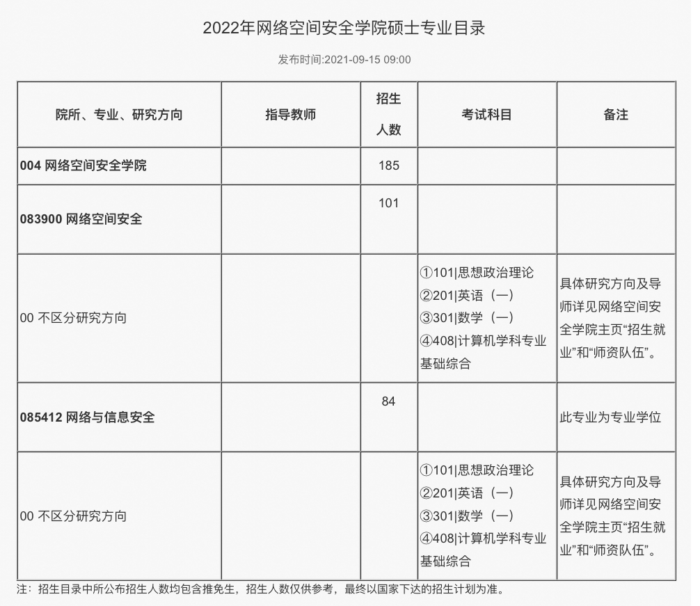
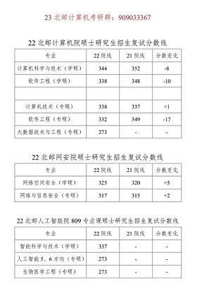
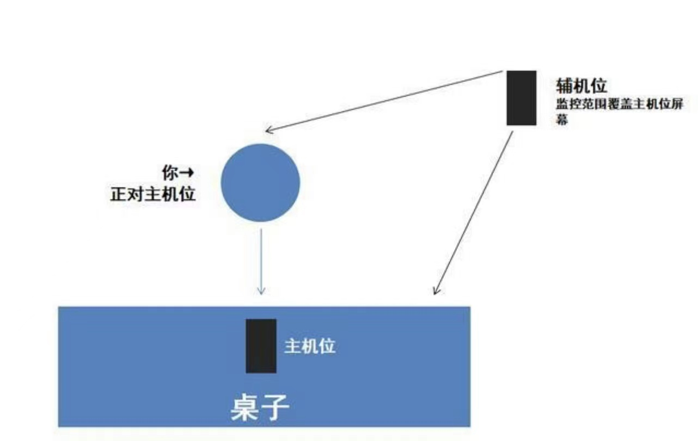
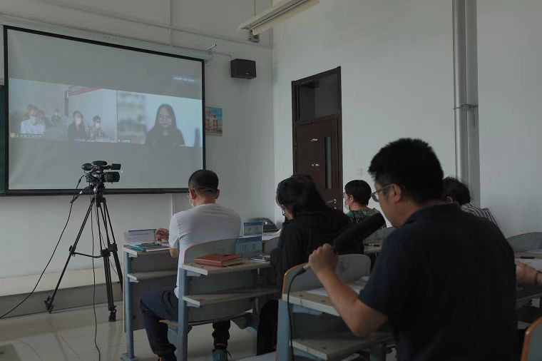

# 北京邮电大学计算机考研

北京邮电大学计算机考研资料汇总大全

> -适用报考范围：  **计算机学院（国家示范性软件学院）**、**网络空间安全学院**、**人工智能学院**

__[23北邮计算机考研QQ交流群：**909033367**](https://jq.qq.com/?_wv=1027&k=rXIQYEve)__  

## 信息汇总

**前言**：牛顿说：“如果说我看得⽐别⼈更远些，那是因为我站在巨⼈的肩膀上。”

## 目录       

> **简介**：本文汇集了众多北邮计算机考研高频疑问，帮助大家掌握北邮考研特点，并免费提供北邮考研资料。

## 学院介绍篇
北邮以前共有四个学院属于计算机类，分别为：计算机学院、网络技术研究院、网络空间安全学院、软件学院。
后经过院系调整，将计算机学院、网络技术研究院、软件学院合并为一个学院，称为计算机学院（国家示范性软件学院）；将北邮原人工智能相关实验室合并为人工智能学院。
因此，北邮现在的计算机类学院有三个，分别为：**计算机学院（国家示范性软件学院）、网络空间安全学院、人工智能学院。**

**这三个学院的专业可分为三类，分别为：**

**408专业课类**（数据结构、计算机组成原理、操作系统、计算机网络）

**807专业课类**（数据结构、操作系统）

**809专业课类**（数据结构）

1.考408专业课的专业有
> 计算机学院（国家示范性软件学院）：计算机科学与技术（学硕）、计算机技术（专硕）、大数据技术与工程（专硕）；
> 
> 网络空间安全学院：网络空间安全（学硕）、网络与信息安全（专硕）；

2.考807专业课的专业有
>计算机学院（国家示范性软件学院）：软件工程（学硕）、软件工程（专硕）；

3.考809专业课的专业有
>人工智能学院：智能科学与技术（学硕）、人工智能的5组和6组（专硕）、生物医学工程（专硕）。

**注：以上所有学硕和专硕都考数学一和英语一。**

不同学院的招生人数、报考人数、录取平均分差别巨大！因此，考北邮首先要明确自己想考哪个学院！你可能会问：这么多学院，它们有啥区别？最大的区别是它们的主流研究方向和实验室不同。
比如：有位同学本科学的是软件工程，他想继续学习本专业，那么他可以考虑计算机学院的软件工程专业；另一位同学本科学的是信息安全，那么他可以考虑网络空间安全学院；现在有很多同学想学习大数据与人工智能，那么可以考虑人工智能学院；当然，大家也可以根据自己的兴趣爱好，选择相应的学院，不是必须要与自己本专业一致。

### 考研招生目录
#### 计算机学院

#### 网络空间安全学院

#### 人工智能学院

## 初试篇  
### 北邮考研官方网站  
- [北京邮电大学研招网](http://yzb.bupt.edu.cn)
- [计算机学院(国家示范性软件学院)](https://scs.bupt.edu.cn/)
- [网络空间安全学院](http://scss.bupt.edu.cn/)
- [人工智能学院](http://ai.bupt.edu.cn/)

### 报录比  
> **简介**：        

#### 1. 2018年北邮报录比    
[2018年北邮各院硕士研究生分专业报考录取情况表](报录比汇总/2018年各院硕士研究生分专业报考录取情况表.doc)

#### 2. 2019年北邮报录比    
[2019年北邮报录比【官方版】](https://yzb.bupt.edu.cn/content/content.php?p=3_10_399)

#### 1. 2020/2021年北邮报录比    
[2020、2021年北邮各院硕士研究生分专业报考录取情况表](报录比汇总/20和21报考录取情况.doc)

### 专业课真题  

#### 1. 408真题  
[2009计算机考研408真题](408专业课试卷和大纲/2009计算机考研408真题.pdf)    
[2010计算机考研408真题](408专业课试卷和大纲/2010计算机考研408真题.pdf)    
[2011计算机考研408真题](408专业课试卷和大纲/2011计算机考研408真题.pdf)  
[2012计算机考研408真题](408专业课试卷和大纲/2012计算机考研408真题.pdf)    
[2013计算机考研408真题](408专业课试卷和大纲/2013计算机考研408真题.pdf)    
[2014计算机考研408真题](408专业课试卷和大纲/2014计算机考研408真题.pdf)  
[2015计算机考研408真题](408专业课试卷和大纲/2015计算机考研408真题.pdf)    
[2016计算机考研408真题](408专业课试卷和大纲/2016计算机考研408真题.pdf)    
[2017计算机考研408真题](408专业课试卷和大纲/2017计算机考研408真题.pdf)  
[2018计算机考研408真题](408专业课试卷和大纲/2018计算机考研408真题.pdf)    
[2019计算机考研408真题](408专业课试卷和大纲/2019计算机考研408真题.pdf)    
[2020计算机考研408真题](408专业课试卷和大纲/2020计算机考研408真题.pdf)  
[2021计算机考研408真题](408专业课试卷和大纲/2021计算机考研408真题.pdf) 

#### 2. 803真题  
[2016年803计算机学科基础综合真题](803专业课试卷/803计算机学科基础综合-2016.pdf)   
[2017年803计算机学科基础综合真题](803专业课试卷/803计算机学科基础综合-2017.pdf)    
[2018年803计算机学科基础综合真题](803专业课试卷/803计算机学科基础综合-2018.pdf)   
[2019年803计算机学科基础综合真题](803专业课试卷/803计算机学科基础综合-2019.pdf)  

#### 3. 807真题  
[2013年807软件工程专业综合真题](807专业课试卷/807软件工程专业综合-2013.pdf)  
[2014年807软件工程专业综合真题](807专业课试卷/807软件工程专业综合-2014.pdf)  
[2015年807软件工程专业综合真题](807专业课试卷/807软件工程专业综合-2015.pdf)  
[2016年807软件工程专业综合真题](807专业课试卷/807软件工程专业综合-2016.pdf)  
[2017年807软件工程专业综合真题](807专业课试卷/807软件工程专业综合-2017.pdf)    
[2018年807软件工程专业综合真题](807专业课试卷/807软件工程专业综合-2018.pdf)    
[2019年807软件工程专业综合真题](807专业课试卷/807软件工程专业综合-2019.pdf)  
[2020年807软件工程专业综合真题](807专业课试卷/807软件工程专业综合-2020.pdf)    
[2021年807软件工程专业综合真题](807专业课试卷/807软件工程专业综合-2021.pdf)    

### 考试大纲
[2022年408专业课大纲](408专业课试卷和大纲/2022年408专业课大纲.pdf)  
[2022年计算机统考408大纲变化](2022/考纲变化、2022年计算机统考408大纲变化.doc)

### 北邮考研经验分享       
[22北邮网安院专硕状元考研经验分享](22北邮考研经验分享/22北邮计算机考研初试414分经验分享.pdf) 

[22北邮网安考研初试376分复习经验分享](22北邮考研经验分享/22北邮网安考研初试376分复习经验分享.pdf)

[北邮计算机考研经验分享](https://www.zhihu.com/question/473004339/answer/2279685355)

### 就业
> [2021年北邮毕业生就业质量报告](https://zhuanlan.zhihu.com/p/452565043)
> 
> [2020年北邮毕业生就业质量报告](https://zhuanlan.zhihu.com/p/438818909)
> 
> [2019年北邮毕业生就业质量报告](https://zhuanlan.zhihu.com/p/438824915)

### 关于报考  

#### 高频问题

#####  1. **选择学硕还是专硕？**    
> 研究生按照培养目标分为学术型硕士和专业型硕士，按照培养方式分为全日制和非全日制。
>> 学术型硕士侧重学术研究，学硕包括计算机科学与技术专业、网络空间安全专业、软件工程专业、智能科学与技术专业。
>> 专业型硕士侧重工程开发，国家对计算机、电子、通信三大行业的专硕进行了统一命名，叫做电子信息专业。
> 全日制需要全职读书，不能边读边工作，全日制录取后会提档案。非全日制可以边工作边读书，大多数都是周末授课，录取后不提档案。学硕都是全日制，专硕有一部分进行非全日制招生。
> 北邮全日制学硕和专硕，初试科目、学制、学费、奖助学金制度、就业认可度上都是一样的，而且都提供宿舍，这里重点提醒北邮专硕也考数学一、英语一！因此，总体来说学硕和专硕差别不是很大。
> 北邮非全日制学费一年1.2万，学制三年，考试科目和全日制一样，不提供宿舍，没有奖助学金。
> 接下来列举学硕和专硕优缺点以供参考！

>> `学硕优点`：可以直博（研一、研二可以申请硕博连读）。

>> `学硕缺点`：毕业论文要求高一点（毕业答辩前要发一篇小论文)，而且学硕保研占一半，考研名额会少一点。

>> `专硕优点`：毕业要求低一些，考研时复试线比学硕低一些（但近几年和学硕的线差不多，甚至有的组已经反超）。

>> `专硕缺点`：专业名字难听，乍一看以为是电子类；不能直博；考研复试不能调剂到学硕。

> **提示**：北邮考研是分组制，每个组对于学生的培养是组内根据项目进行制定的，所以不是学硕一定做研究，也不是专硕一定做开发，具体安排由每个导师自己决定。

> **总结：想往学术方向发展，可以选择学硕。想以就业为导向，而且对专业名字不在意，可以考虑专硕 。同时，要根据每个学院具体情况，选择考学硕还是专硕。**

#####  2. **请问考北邮需要具备什么样的实力？我本科不太好，会不会进了复试也会被淘汰？**  
> 对于这个问题，可能仁者见仁智者见智，我根据自己的经验谈一谈。
> 首先北邮在211院校中排名靠前，同时计算机实力很受社会认可，因此每年报考北邮计算机类专业研究生的同学非常多。
> 在北邮研究生中，北邮土著约占40%，其他985/211学校同学约占25%，普通本科同学约占35%。当然这是平均比例，对于不同学院和不同组，会存在较大的差别。
> 大多数报考北邮的同学，项目经验、代码能力、本科成绩都较为普通，所以大家不用觉得自己大学没学好就一定考不上北邮。
> 毕竟初试只看分数，并且我认为：初试高分=努力复习+科学的复习方法+严厉的监督。因为很多同学大学期间玩疯了，一时难以收住心，而且不是所有同学都具有很强的自制力，所以监督尤为重要。
> 综上，只要你觉得自己可以做到努力复习，同时又掌握了科学的复习方法，并且也有人严厉监督你，那么你就可以考北邮!

#####  3. **你参加过哪些比赛？做过哪些项目？？**  
> 没有比赛，项目会不会不占优势？这一点也是好多理工科的同学咨询我最多的问题，我想说的是，没关系。 这里要明白一点，面试的时候问项目，其实是在考察你在一个项目中所承担的角色，你对自己做的事的了解程度以及能反应出来的你的能力。
1）、有实习经历的情况下，好好准备实习期间你从事的岗位和工作，所参与项目的背景，意义，框架，负责内容的逻辑构成，技术栈，怎么实现的，有什么难点和解决方法，用了什么平台，什么开发环境，编译器类型等等。
2）、没有实习经历的，准备两段自己的课程设计，比如组队开发了一个小游戏或者搭建了一个平台，这些都可以。思路也是和实习经历的准备一样，建议用Word写下来，整理成体系。
（老师，虽然我没有参加过比赛，但是我大学期间印象最深的项目是我大三的时候担任组长参与的股票数据分析系统，这个项目旨在实现xxxx，解决xxxx难题。我们采用了三种系统结构，分别是数据采集系统、数据分析系统、数据深度学习系统，其中数据采集系统的框架是xxxx，采用Python语言，数据来源于xxxxx；数据分析系统采用XXXX，用XXX技术搭建了XXXX模型，采用XXX的方法对数据进行处理，用到的数学方法是XXX；数据深度学习系统采用XXX深度学习理论，创建XXXX，数据优化阶段使用了XXX，最后我们实现XXX，达到了XXXX效果。）开头转移话题，老师会顺着话听下去，不会打断的，不要说老师不好意思我没有参加过比赛，那这一问直接0分，回答课设起码及格分是有的，回答好了还会加分。

---
## 复试篇  

### 分数线  
#### 1. 分数线简介  
北邮的分数线可以分为种：`国家线`、`院线`
一般情况下：**国家线**≤**院线**
> `国家线`：国家线是教育部统一划定的复试最低控制分数线，低于国家线的考生无法参加研究生复试。       

> `院线`：院线是决定考生是否有资格参加本院所报考专业复试的最低控制分数线，低于院线的原报考生不能参加本院报考专业的复试。 

##### 国家线   

计算机类专业属于工科，梳理下最近四年的工科线：

（1） 22考研总分线是273分，英语和政治的单科线是38分，数学和专业课的单科线是57分。 

（2）21考研总分线是263分，英语和政治的单科线是37分，数学和专业课的单科线是56分。 

（3）20考研国家线的总分线是264分，英语和政治的单科线是37分，数学和专业课的单科线是56分。

（4）19考研国家线的总分线是270分，英语和政治是39分，数学和专业课是59分。 

因此，由最近4年的国家线可以看出来，每一年国家线变化不是特别大。对于考北邮来说，国家线只是最低要求，能否进复试，最终看的是北邮院线，北邮院线一般是国家线公布后7-10天公布。

##### 院线
 

**22北邮计算机学院分数线呈现整体下降态势，已经多年保持稳定分数线，没有大的起伏。**

##### 复试高频问题 
-  [考研初试出成绩后联系导师应该注意什么？](https://www.zhihu.com/question/515734321/answer/2350701783)

##北邮复试
### 复试的重要性
初试是入场券，复试是竞技场。初试考的好的请一定稳住，考的不好的请好好准备，争取逆风翻盘！

### 复试流程
初试成绩出分--联系导师--官网发布复试线--面试--公示

### 复试准备内容

(机试、笔试)、综合面试、联系导师、个人简历、项目等

22考研与21考研复试最大区别是，22考研计算机学院全日制专业复试新增了机试，采用线上机试模式
该变化说明复试机试已回归，20考研由于疫情取消了机试，22考研重新开始考察机试，23考研同学要注意复试变化。

#### 机试
因为疫情的原因，22考研计算机学院采用线上机试的形式。

**平台：** OMS监考系统（https://oms.pintia.cn/）

**模式：** 双机位模式，需要2部带摄像头的设备（笔记本电脑或台式电脑、手机或PAD）。

**考察内容：** 上机测试主要考察考生基本的编程语言掌握情况及代码设计能力，相关开发环境的调试技巧，算法设计与程序设计实现能力。上机测试成绩不作量化，不计入总成绩，测试结果可做为综合面试评分的参考项。

机试叫作OJ，全称是Online Judge，它是一种在线考试系统，用户可以在线读题，然后提交多种程序源代码（C/C++/Java），系统会对源代码进行编译和执行，并通过预先设计的测试数据来检验程序源代码的正确性，若代码运行结果符合要求，则通过，即A出来了；否则有一点点错误都会无法通过。往年机试共四题，可以无限次提交代码，提交错误不会扣分，但是提交失败会降低相同分数段的排名，这个规定对于考研来说没啥作用，考研只关心你做出几题，不关心你的系统排名。
考试时间两小时，共四道中文算法题。四道题目中，一般前两道比较基础，后两道会难一些。机试的题目是每个学院单独出题，但是题目风格相近。对于机试的复习，首先要掌握好理论知识，然后要重视上机练习，尤其要进一些开放的OJ平台进行在线练习。很多时候，我们在本地编译器运行时认为代码通过，但是OJ系统评判为不通过。因为OJ系统很严格，它们会通过很多种样例进行测试，只要有一种不符合就会判为错误。我们本地编译时最多用一两种样例进行测试，这明显是不够的。

**双机位**
 
 
 
 

#### 笔试
从20年开始，笔试因为疫情而取消，这里简单介绍一下，复试笔试分为两类，一类叫做六选四，另一类叫做两门必考。
六选四的意思是让同学们从六门给定的科目中任意选择四门课进行作答，这个选择是不需要在系统中填写的。具体形式是考试当天，试卷中会有六门课的所有题目，考生根据提前复习的科目在试卷的选科目处进行选择。题目全都是选择题，共60道，每门课15道，考试时间一个小时。题目多、时间短，考试过程非常紧张，基本读完题目就要选出答案，不能有任何迟缓。最后的答案还需要涂卡，涂卡也需要填写你考的科目号。
两门必考是软件工程和计算机网络，考试时间为一个小时，题目包括选择题和填空题。题目难度较低，多以概念题为主。

#### 综合面试
**平台：** 腾讯会议

**考察内容：** 专业面试主要考核外语听说、应用水平，专业基础知识掌握程度，利用专业学科理论发现、分析和解决问题的能力，对本学科发展动态的了解以及在本专业领域发展的潜力。从***基础知识、实际能力、研发潜力、英语运用能力、综合素质等方面*** 对考生进行考察评分。

面试遵循固定的程序，采用专门的题库、评分标准，通过考官与考生面对面的言语交流，从而评判考生能力的方式。

**过程：** 面试时分为等待环节和面试环节，首先在等待室进行等待，秘书会给考生编好顺序，然后考生按照顺序依次进行面试，每个组大概5-6位考官。由秘书向考生展示试卷，考生依次从没被挑选的试卷中进行选择，然后秘书读题，考生依次作答，考官再进行打分。整场考试学生与考官没有过多交流。

**题型：** 英语问题、政治问题、408基础知识问题、项目和毕设问题、报考学院和组研究方向问题、开放性问题等。

**时间：** 不少于20分钟

**提前准备的材料：** 学生证或毕业证、本科毕业设计介绍（1500字内）、发表学术论文和获奖证明、本科成绩单（盖章）、四六级证书 + 学院要求提交的材料

22复试采用线上面试的方式，与往年有很大的区别。面试主要是使用腾讯会议软件进行面试，面试分为等待环节和面试环节。首先每个组的同学在等待室进行等待，面试秘书会给同学们编好顺序，然后按照顺序依次进行面试。每个组大概5-6位老师，每位同学20分钟的时间。

**> 线上面试问题举例**

**政治问题：**
谈谈对新疆棉花事件的看法。
谈谈你大学期间印象最深的一段经历。
**英语问题：**
翻译一段关于边缘计算的英文文献。
用中文进行自我介绍。
**其他问题：**
你的意向导师是谁？
谈谈对端口和套接字的理解。
谈谈对NP问题的认识。
谈谈什么是机器学习、无监督学习和监督学习，以及三者之间的优劣。

**政治问题：**
你如何看待中美关系？
**英语问题：**
用英语介绍一下你自己。
**其他问题：**
简述下TCP建立连接的过程。
请说明一下冒泡排序的过程。
什么是虚拟内存管理？有哪些页面置换算法？
C与Java有哪些区别？
已知你有6升和5升的杯子，如何通过这两个杯子，量出3升的水？
数字图像可以应用到哪些领域？
简述下你的毕业设计；在做毕设过程中，遇到了哪些问题？你如何解决这些问题？

**面试题我有总结过一些，可参考文章**
[22北邮复试建议](https://www.zhihu.com/question/518549416/answer/2377198179)

[综合面试专业课题库](https://zhuanlan.zhihu.com/p/475519720)

#### 联系导师
[联系导师需要需要注意些什么？](https://www.zhihu.com/question/515734321/answer/2350701783)

[计算机学院招生团队介绍](https://zhuanlan.zhihu.com/p/417669419)

[网络空间安全学院招生团队介绍](https://zhuanlan.zhihu.com/p/420667047)

[人工智能学院招生团队介绍](https://zhuanlan.zhihu.com/p/422158389)

#### 考场行为细节
从进入腾讯会议视频的那一刻起，复试考试就开始了。进入考场前先找个安静的环境，保持网络通畅。自信一点，双眼平视前方，保持微笑。 
1、不要有太多的小动作：你从开始线上面试到结束，都要注意自己的小动作，像望着天花板、拂头发摸耳朵、咬嘴唇、抖腿、无意识的玩手指、玩笔等，都要尽量避免。 
2、回答老师的提问时，注意音量和节奏。音量适当地提高半拍，因为人在紧张的时候，可能会不自觉压低声音，注意抑扬顿挫。语速不要过快，因为语速太快你的思考的时间被压缩，会容易出现脱节卡壳的状况。一定要掌握好说话的节奏，边说边想。 语调要有抑扬顿挫。也要减少自己在紧张时无意识说的语气词、口头禅，像：啊...嗯...啦...然后，那个，就是等。在练习的时候，可以给自己录音，反复拿来听。 

#### 复试细则  
> **简介**：复试细则会公布院线、调剂政策、复试安排等。       

##### 计算机学院复试细则     

[2019年计算机学院复试细则](2019/复试细则和工作安排//北京邮电大学计算机学院2019年硕士研究生招生复试细则.pdf) 
[2020年计算机学院复试细则](2020/复试细则//2020计算机学院复试细则.pdf) 
[2021年计算机学院复试细则](2019/21复试细则//2021年计算机学院复试录取细则.pdf) 
[2022年计算机学院复试细则](2022/复试细则//22年北邮计算机学院复试细则.pdf) 

##### 网络空间安全学院复试细则 
    
[2019年网安院复试细则](2019/复试细则和工作安排/网络空间安全学院2019年硕士研究生招生复试细则.pdf)  
[2019年网安院复试工作安排](2019/复试细则和工作安排/2019年网络空间安全学院硕士研究生招生复试工作安排.pdf) 
[2020年网安院复试细则](2020/复试细则//网络空间安全学院2020年硕士研究生复试录取细则.pdf) 
[2021年网安院复试细则](2019/21复试细则//2021网络空间安全学院复试录取细则.pdf) 
[2022年网安院复试细则](2022/复试细则//22年北邮网安院复试细则.pdf) 

##### 网络技术研究院复试细则  
    
[2019年网研院复试细则](2019/复试细则和工作安排/网络技术研究院2019年硕士研究生招生复试细则.pdf)      
[2019年网研院复试工作安排](2019/复试细则和工作安排/2019年网络技术研究院硕士研究生招生复试工作安排.pdf)    

##### 软件学院复试细则  
 
[2019年软件学院复试细则](2019/复试细则和工作安排/软件学院招收2019年硕士研究生复试录取细则.pdf)    

#### 初试成绩排名       

> **简介**：北邮的初试成绩排名包含了所有过院线考生的初试成绩，并且按照初试成绩分组降序排序。这是北邮官方在复试细则出来后公开发布的成绩排名。考生可以在这个文件中看到自己确切的组内排名。           

##### 2018年初试成绩排名    
- [2018年计算机学院初试成绩排名](2018/初试成绩排名/2018年计算机学院学院硕士生招生初试成绩排名.doc)      
- [2018年网络技术研究院初试成绩排名](2018/初试成绩排名/2018年网研院硕士招生初试成绩排名.jpg)       
- [2018年网络空间安全学院初试成绩排名](2018/初试成绩排名/2018年网络空间安全学院硕士生招生初试成绩排名.pdf)      

#### 复试名单   

>  **简介**：复试名单中会列出各组参加复试的人数、初试成绩、是否一志愿（原报）等信息。       

##### 计算机学院复试名单  
        
[2018年计算机学院复试名单(一)](2018/复试名单/2018年计算机学院硕士生招生复试名单.pdf)       
[2018年计算机学院复试名单(二)](2018/复试名单/2018年计算机学院硕士研究生招生复试名单（二）.pdf)       
[2018年计算机学院复试名单(三)](2018/复试名单/2018计算机学院硕士研究生招生复试名单（三）pdf.pdf)      
[2019年计算机学院复试公示名单（全日制）](2019/复试名单/2019年计算机学院复试公示名单（全日制）.pdf)      

##### 网络技术研究院复试名单  
 
[2018年网研院复试名单](2018/复试名单/2018年网研院硕士招生复试名单.pdf)        
[2019年网研院复试名单(全日制)](2019/复试名单/网络技术研究院2019年硕士研究生招生复试名单（全日制）.pdf)        

##### 网络空间安全学院复试名单   
[2018年网安院复试名单](2018/复试名单/2018年网络空间安全学院硕士生招生复试名单.pdf)      
[2019年网安院复试名单](2019/复试名单/网络空间安全学院2019年硕士研究生招生复试名单.pdf)      

##### 软件学院复试名单  
[2018年软件学院学硕复试名单](2018/复试名单/2018年北京邮电大学软件学院软件工程学术型硕士（专业代码：083500）复试名单.xlsx)        
[2018年软件学院全日制专硕复试名单](2018/复试名单/2018年北京邮电大学软件学院软件工程全日制专业学位硕士（专业代码：085212）复试名单.xlsx)     
[2018年软件学院非全日制专硕复试名单](2018/复试名单/2018年北京邮电大学软件学院软件工程非全日制专业学位%20硕士（专业代码：085212）复试名单.xlsx)   
[2019年软件学院学硕复试名单](2019/复试名单/2019年软件学院学术学位硕士生招生复试名单.pdf)   
[2019年软件学院专硕复试名单(全日制)](2020/复试名单/2019年软件学院专业学位硕士生招生复试名单.pdf)   
[2019年软件学院阿灵顿项目全日制专硕复试名单](2020/复试名单/2019年软件学院阿灵顿项目接收全日制专业学位硕士生招生复试名单.pdf)   

#### 复试形式

#### 复试录取结果    
> **简介**： 可以从复试结果中看到各组当年实际招收的人数和复试刷人情况。       

##### 计算机学院复试结果  
[2018年计算机学院复试结果(全日制)](2018/复试录取结果/2018年计算机学院硕士招生复试结果（全日制）.pdf)    
[2018年计算机学院复试结果(非全日制)](2018/复试录取结果/2018年计算机学院硕士招生复试结果（非全日制）.pdf)  
[2020年计算机学院复试结果](2020/20各院复试录取结果/20年计算机学院硕士生招生复试结果.pdf) 
[2021年计算机学院复试结果](2021/21各院初试和复试资料汇总/21计算机学院硕士招生录取结果.pdf)

##### 网络技术研究院复试结果     
[2018年网研院复试结果](2018/复试录取结果/2018年网研院硕士生招生复试结果.pdf)   
[2020年网研院复试结果](2020/20各院复试录取结果/20年网络技术研究院硕士生招生复试结果.png) 

##### 网络空间安全学院复试结果   
[2018年网安院复试结果](2018/复试录取结果/2018年网络空间安全学院硕士研究生招生复试结果.pdf)   
[2020年网安院复试结果](2020/20各院复试录取结果/20年网络空间安全学院硕士生招生复试结果.pdf) 
[2021年计算机学院复试结果](2021/21各院初试和复试资料汇总/21网络空间安全学院硕士招生录取结果.pdf)

##### 软件学院复试结果                    
[2018年软件学院复试结果（学硕）](2018/复试录取结果/2018年北京邮电大学软件学院学术型硕士复试结果公示.pdf)     
[2018年软件学院复试结果（全日制专硕）](2018/复试录取结果/2018年北京邮电大学软件学院全日制专业硕士复试结果公示.pdf)      
[2018年软件学院复试结果（非全日制专硕）](2018/复试录取结果/2018年北京邮电大学软件学院非全日制专业硕士复试结果公示.pdf)    
[2020年软件学院复试结果](2020/20各院复试录取结果/20年软件学院硕士生招生复试结果.pdf) 

##### 人工之智能学院复试结果 
[2021年计算机学院复试结果](2021/21各院初试和复试资料汇总/21人工智能学院硕士招生录取结果.pdf)

### 北邮拟录取名单

#### 2018年北邮拟录取名单      
[2018年北邮统考硕士研究生拟录取名单](2018/复试录取结果/2018年北京邮电大学统考硕士研究生拟录取名单.pdf)       
[2018年北邮计算机拟录取名单（初试成绩降序版）](2018/复试录取结果/2018年北邮计算机统考硕士研究生拟录取名单（初试成绩降序版）.pdf)                

